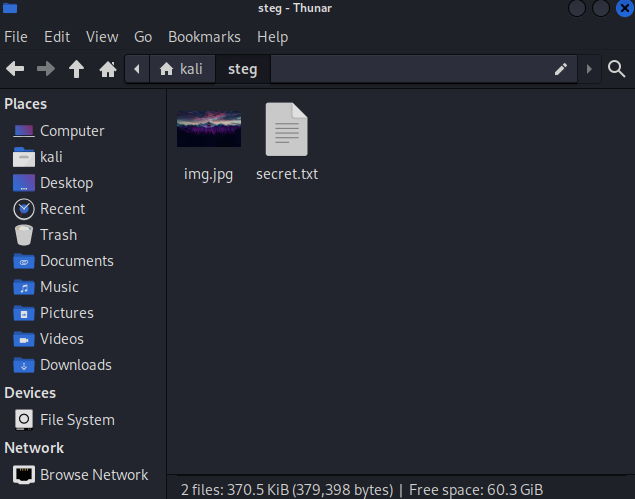
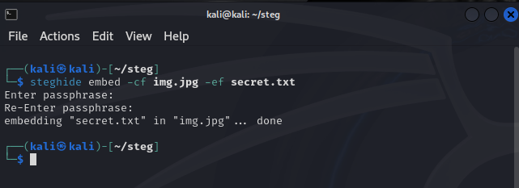

# Steganography

## Objective:
The purpose of this short project is to experiment around with Steganography, which is the art of hiding information in almost anything. This could be beneficial in storing sensitive information, such as passwords,
in a clever manner.

### Skill learned:
- Concealing information
- steghide

## Steps:
- These steps are done in Kali Linux by using steghide, which I had already installed.
1. First, for the sake of organizing everything, I created a new directory called "steg"
2. Then, I entered it and created a new text file called `secret.txt`, whose content is just "secret text"
3. I got a random image from Google and put that in the same directory, so now I have:
  

4. Now, I just need to embed the text file into the image, which I did by using the following command: `steghide embed -cf img.jpg -ef secret.txt`. After hitting enter, it asked for a passphrase, for security measures:
  
5. Here comes the cool part, if I delete the text file, and then extract the text file's content from the image, the file will actually show up. I used `steghide extract -sf img.jpg` to extract.
6. Then, just to make sure, I used `cat secret.txt` to show the content, and it displayed the original text "secret text"

- Overall, this is an extremely powerful approach in concealing information, especially with the requirement of having a passphrase, which reduces the chances of another party unlocking the contents of the file.
